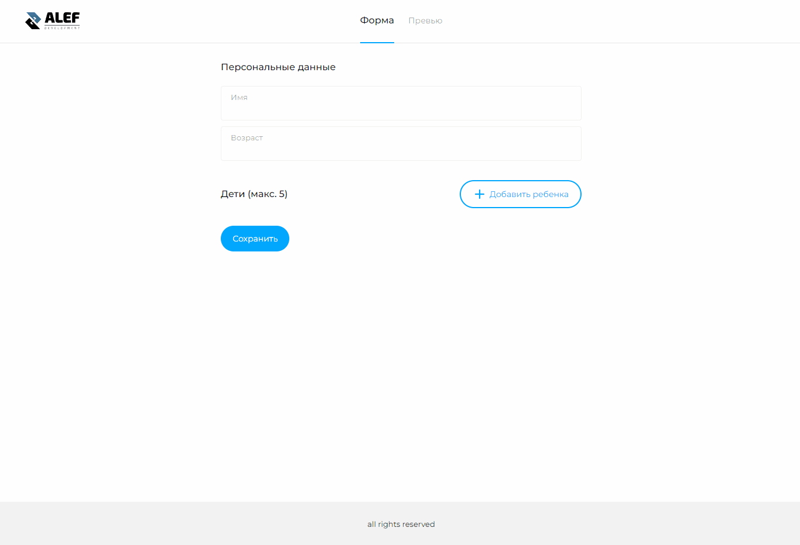

# Тестовое задание на вакаснию Frontend-разработчик в компанию [Alef Development](https://alef.im/)

### Макет - https://www.figma.com/file/34RHaNzxPnoTPCtpIrqMYU/React-Alef?node-id=2286%3A7698

## Функционал:

1. Разработайте веб приложение с помощью фреймворка VueJS, где пользователь может заполнить информацию о себе и своих детях.
2. Должны быть поля ввода ФИО и возраста пользователя.
3. Ниже должна вводится информация о детях. Изначально пользователь видит только кнопку "+", при нажатии на нее появляется блок в котором можно ввести информацию о ребенке: Имя и возраст. Таким образом пользователь может добавить вплоть до 5 детей. Когда пользователь добавил 5 детей — кнопка "+" исчезает и больше недоступна. Так же напротив каждого ребенка есть кнопка "удалить" , при нажатии на которую соответствующая запись удаляется.
4. Реализовать функционал нужно без серверной части. При нажатии на кнопку "Сохранить" введенные данные должны отображаться на странице "Превью".

## Зависимости

1. `Core-Js: ^3.8.3`,
2. `Vue: ^3.2.13`,
3. `Vue-Router: ^4.0.13`
